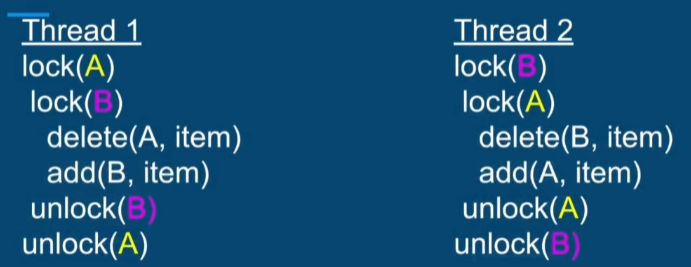
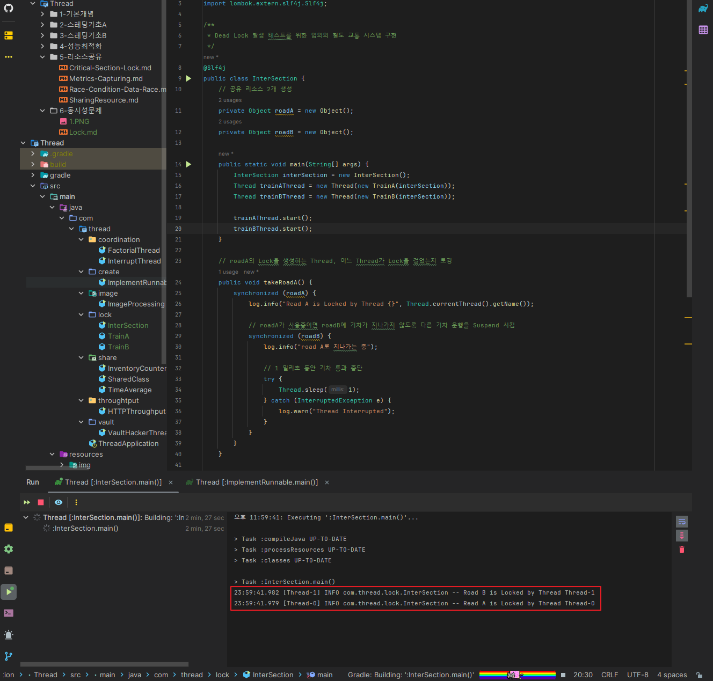
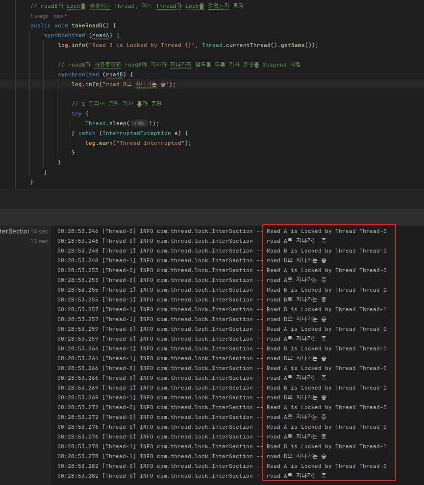

## Lock & Dead Lock

멀티스레딩 환경에서 Lock을 구현할 때 Fine-Grained Lock & Coarse-Grained Lock을 선택할 수 있습니다.

여러 스레드가 공유하는 Resource가 있을 때 

- 모든 공유 리소스에 단일 Lock을 걸어 제한하거나,
- 각 리소스마다 개별적인 Lock을 걸어 제한할 수 있습니다.

<br>

### Coarse-Grained Lock

Coarse-Grained Lock의 장점은 단일 Lock만 신경쓰면 되며, 공유 리소스에 액세스 할 떄 해당 Lock만 사용합니다.

- 아래 클래스에서 두 함수에 `synchronized` 키워드를 사용해 모든 객체에 단일 Lock을 생성 하도록 할 수 있습니다.
- 아래 두 함수에서 DB에서 Item을 가져오는 스레드와 그 작업을 Queue에 추가하려는 스레드가 있습니다.
- 작업을 Queue에 추가하려는 Thread는 첫번쨰 Thread에서 Item을 가져올 떄 까지 Queue에 작업을 추가할 수 없습니다.

위 방법은 동시성을 해결하는 간단한 방법일 수 있지만, 다른 연산과 상호작용하지 않고, 리소스 오버헤드가 클 수 있고,

최악의 경우 한 번에 1개의 스레드만 실행되는 동기적인 프로세스가 될 수 있습니다.

```java
/**
 * 2개의 공유 리소스 (DB 커넥션, Task Queue)를 가지는 클래스
 * 이 2개의 공유 리소스는 동시 Access에 대응하는 Protection이 필요함
 */
public classSHaredClass {
    private DatabaseConnection dbConnection;
    private List<Task> tasksQueue;
    
    public Item getItemFromDB() {
        // DB의 Item을 가져오는 스레드
    }
    
    public void addTaskToQueue() {
        // 큐에 작업을 추가하려는 스레드git
    }
}
```

---

### Fine-Grained Lock

위 Coarse-Grained Lock과 다르게 공유 리소스를 개별적으로 Lock을 걸어 잠근다면,

모든 리소스에 개발 Lock을 생성하는 것과 동일한 효과를 가집니다.

이렇게 처리학게 되면 프로그램은 좀 더 병렬적인 처리를 할 수 있고 Race Condition 가능성을 낯춥니다.

<br>

**Fine-Grained Lock의 단점 - Dead Lock**

리소스에 개별적으로 Lock을 걸면 발생할 수 있는 문제는 Dead Lock 입니다.

아래는 Dead Lock이 발생하는 코드 예시 입니다.



Thread 1에서 리소스 A에 Lock을 걸고, Thread 2에서 리소스 B에 Lock을 겁니다. (성공)

그 후 Thread 1에서 리소스 A로부터 Item을 삭제하고 B에 Item을 추가합니다. (실패)

Thread 2에서 리소스 B로부터 Item을 삭제하고 A에 Item을 추가합니다. (실패)

<br>

각 스레드에서 2번쨰 Lock을 걸 떄 실패하는 이유는 아래와 같습니다.

Thread 1에서 먼저 리소스 A에 Lock을 걸고, Thread 2에서는 리소스 B에 먼저 Lock을 걸었기 떄문에,

각 스레드에서 Lock을 해제하기 전 까지 스레드는 교착 상태에 놓이고 더 이상 프로세스를 진행하지 않습니다.

---

## Dead Lock 발생 코드 구현

간단한 철도 교통 시스템을 예시로 구현해 보겠습니다.

철도 A,B를 만들어 철도를 사용 중이면 Lock을 걸고, 1밀리초 동안 Thread를 Sleep 시키고,

2개의 Thread와 임의의 철도 스케쥴을 만들어 2개의 스레드를 동시에 실행합니다.

<br>

**InterSection**

```java
/**
 * Dead Lock 발생 테스트를 위한 임의의 철도 교통 시스템 구현
 */
@Slf4j
public class InterSection {
    // 공유 리소스 2개 생성
    private Object roadA = new Object();
    private Object roadB = new Object();

    public static void main(String[] args) {
        InterSection interSection = new InterSection();
        Thread trainAThread = new Thread(new TrainA(interSection));
        Thread trainBThread = new Thread(new TrainB(interSection));

        trainAThread.start();
        trainBThread.start();
    }

    // roadA의 Lock을 생성하는 Thread, 어느 Thread가 Lock을 걸었는지 로깅
    public void takeRoadA() {
        synchronized (roadA) {
            log.info("Read A is Locked by Thread {}", Thread.currentThread().getName());

            // roadA가 사용중이면 roadB에 기차가 지나가지 않도록 다른 기차 운행을 Suspend 시킴
            synchronized (roadB) {
                log.info("road A로 지나가는 중");

                // 1 밀리초 동안 기차 통과 중단
                try {
                    Thread.sleep(1);
                } catch (InterruptedException e) {
                    log.warn("Thread Interrupted");
                }
            }
        }
    }

    // roadB의 Lock을 생성하는 Thread, 어느 Thread가 Lock을 걸었는지 로깅
    public void takeRoadB() {
        synchronized (roadB) {
            log.info("Road B is Locked by Thread {}", Thread.currentThread().getName());

            // roadB가 사용중이면 roadA에 기차가 지나가지 않도록 다른 기차 운행을 Suspend 시킴
            synchronized (roadA) {
                log.info("road B로 지나가는 중");

                // 1 밀리초 동안 기차 통과 중단
                try {
                    Thread.sleep(1);
                } catch (InterruptedException e) {
                    log.warn("Thread Interrupted");
                }
            }
        }
    }
}
```

<br>

**TrainA & TrainB**

```java
// Train A Thread
@Slf4j
public class TrainA implements Runnable {
    private InterSection interSection;
    private Random random = new Random(); // 임의의 기차 스케쥴 생성

    public TrainA(InterSection interSection) {
        this.interSection = interSection;
    }

    // 같은 연산을 수행하도록 반복
    @Override
    public void run() {
        while (true) {
            // 기차가 오기까지 기다리는 임의의 시간 선택
            long sleepingTime = random.nextInt(5);

            // 임의의 시간만큼 멈춤 -> 임의의 기차 스케쥴이 있다고 가정
            try {
                Thread.sleep(sleepingTime);
            } catch (InterruptedException e) {
                log.warn("Thread Interrupted");
            }

            // 스레드가 다시 동작하면 기차가 roadA를 타고 교차로롤 지남
            interSection.takeRoadA();
        }
    }
}

// TrainB Thread
@Slf4j
public class TrainB implements Runnable {
    private InterSection interSection;
    private Random random = new Random(); // 임의의 기차 스케쥴 생성

    public TrainB(InterSection interSection) {
        this.interSection = interSection;
    }

    // 같은 연산을 수행하도록 반복
    @Override
    public void run() {
        while (true) {
            // 기차가 오기까지 기다리는 임의의 시간 선택
            long sleepingTime = random.nextInt(5);

            // 임의의 시간만큼 멈춤 -> 임의의 기차 스케쥴이 있다고 가정
            try {
                Thread.sleep(sleepingTime);
            } catch (InterruptedException e) {
                log.warn("Thread Interrupted");
            }

            // 스레드가 다시 동작하면 기차가 roadA를 타고 교차로롤 지남
            interSection.takeRoadB();
        }
    }
}
```

위 코드처럼 2개의 Thread를 생성해 실행 시키면 아래 이미지와 같이,

roadA는 Thread-0에 의해 Lock이 걸리고, roadB는 Thread-1에 의해 Lock이 걸렸습니다.

이로 인해 두 Thread 사이에 Dead Lock이 발생해 Thread가 다음 프로세스를 실행하지 못하는 상태가 되었습니다.



---

## Deak Lock이 발생하는 4가지 조건

첫번쨰 Dead Lock 발생 조건은 **Mutual Exclusion(상호 배제)** 가 있습니다.

한 번에 1개의 스레드만 단독으로 리소스에 액세스 할 수 있다는 의미로 위에서 구현한 코드와 같습니다.

<br>

두번째 조건은 **점유와 대기**입니다.

최소 1개의 스레드가 리소스를 점유하며 다른 리소스에 대한 대기를 수행하는걸 의미합니다.

위 예시 코드에서는 1개의 스레드가 아닌 2개의 스레드가 이 2번쨰 조건에 맞는 작업을 수행합니다.(철도 하나를 점유하며 다른 철도를 기다림)

<br>

세번쨰 조건은 **비선점(Non-Preemptive) 할당** 입니다.

스레드가 사용 완료할 떄 까지 리소스를 사용할 수 없다는 조건으로, 다른 스레드의 리소스를 빼앗을 수 없다는 의미입니다.

<br>

네번쨰 조건은 **순환 대기(Circular Wait)** 입니다.

이 현상은 이미 Dead Lock에 빠진 Thread에서 볼 수 있습니다.

위 이미지에서 2개의 스레드가 서로 다른 리소스의 Lock 풀릴떄까지 대기하는 상태를 의미합니다.

---

## Dead Lock Solution

### Lock 순서 유지를 통한 Dead Lock 방지

Dead Lock이 걸리지 않게 하는 방법은 위 4가지 Condition 중 1개도 충족하지 않게 만들면 됩니다.

<br>

이중 가장 간단한 방법은, 마지막 조건인 순환 대기를 예방하는 것으로

**동일한 순서로 공유 리소스를 잠그고** 모든 코드에 해당 순서를 유지하면 됩니다.

이 방법은 Lock을 거는 구조가 단순한 경우에 제일 추천하는 방법입니다.

<br>

이 글의 처음나오는 이미지에서 두 스레드 중 하나의 스레드에서 Lock을 거는 순서를 동일하게 맟추면

순환 종속성이 없어지므로, Dead Lock에 걸릴 일이 없습니다. (Lock을 해제하는 순서는 중요하지 않음)

코드로 보면 위 InterSection 클래스의 takeRoadA(), takeRoadB()에서 `synchronized`로 Lock을 거는 순서만 맟춰주면 해결됩니다.

둘중 하나만 맟춰주면 되니, takeRoadB() 함수를 변경해 보겠습니다.

<br>

**Lock 순서 수정 전**

```java
    public void takeRoadB() {
    synchronized (roadB) {
        log.info("Road B is Locked by Thread {}", Thread.currentThread().getName());

        // roadB가 사용중이면 roadA에 기차가 지나가지 않도록 다른 기차 운행을 Suspend 시킴
        synchronized (roadA) {
            log.info("road B로 지나가는 중");

            // 1 밀리초 동안 기차 통과 중단
            try {
                Thread.sleep(1);
            } catch (InterruptedException e) {
                log.warn("Thread Interrupted");
            }
        }
    }
}
```

<br>

**Lock 순서 수정 후**

```java
    public void takeRoadB() {
        synchronized (roadB) {
            log.info("Road B is Locked by Thread {}", Thread.currentThread().getName());

            // roadB가 사용중이면 roadA에 기차가 지나가지 않도록 다른 기차 운행을 Suspend 시킴
            synchronized (roadA) {
                log.info("road B로 지나가는 중");

                // 1 밀리초 동안 기차 통과 중단
                try {
                    Thread.sleep(1);
                } catch (InterruptedException e) {
                    log.warn("Thread Interrupted");
                }
            }
        }
    }
```

<br>

코드를 수정하고 다시 실행해보면 예상 한대로 Thread들이 멈추지 않으며, 충돌이나 Dead Lock이 발생하지 않고 잘 동작합니다.



<br>

### 복잡한 어플리케이션에서의 Dead Lock 방지

Locking 구조가 복잡한 어플리케이션에서는 Dead Lock을 별도로 Detecting하는 WatchDog을 사용하는 것이 좋습니다.

<br>

예를 들어, Micro Controller의 경우 낮은 단계의 루틴으로 실행됩니다.

주기적으로 특정 레지스터의 Health Check를 수행하며, 스레드나 명령이 있을떄마다 업데이트 되어야 합니다.

WatchDog이 업데이트를 감지하지 못하면 Thread가 응답하지 않는다는 가정하에 재기동을 하게 됩니다.

마찬가지로 WatchDog는 다양한 Thread로 실행될 수도 있으며, Dead Lock Thread를 미리 감지하고 이를 Interrupt 할 수 있습니다.

<br>

또, Lock을 처리하기 전에 다른 스레드에 의해 Lock이 처리 되었는지 확인 후 스레드가 멈추는걸 방지할 수도 있습니다.

이를 tryLock 이라고 합니다.

<br>

하지만 `synchronized`를 사용하면 이미 중단된 Thread를 Interrupt 할 수 없고, tryLock도 사용이 불가능 합니다.

다음에 곧 배울 다른 유형의 Lock 기술에서 위 단점이 해결된 Lock을 사용할 수 있습니다. (나중에 포스팅 예정)

<br>

요약하면 WatchDog를 사용하는 경우는, Lock 순서를 지키는게 불가능할 정도로 복잡한 어플리케이션일 떄 사용할 만 합니다.

---

## Lock 요약

**전체 리소스에 대한 Lock을 거는 방법**

- 구현이 제일 간단하지만 성능이 좋지 않음

<br>

**개별 리소스에 대한 Lock을 거는 방법**

- 병렬성이 더 좋지만 Dead Lock 발생 가능성 존재

<br>

**Dead Lock을 방지하는 해결 방법**

- Locking의 순환 종속성 예방
- 각 Thread에서 리소스를 동일한 순서로 Lock